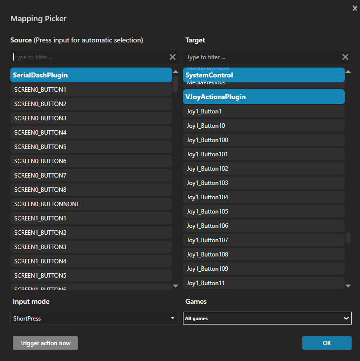
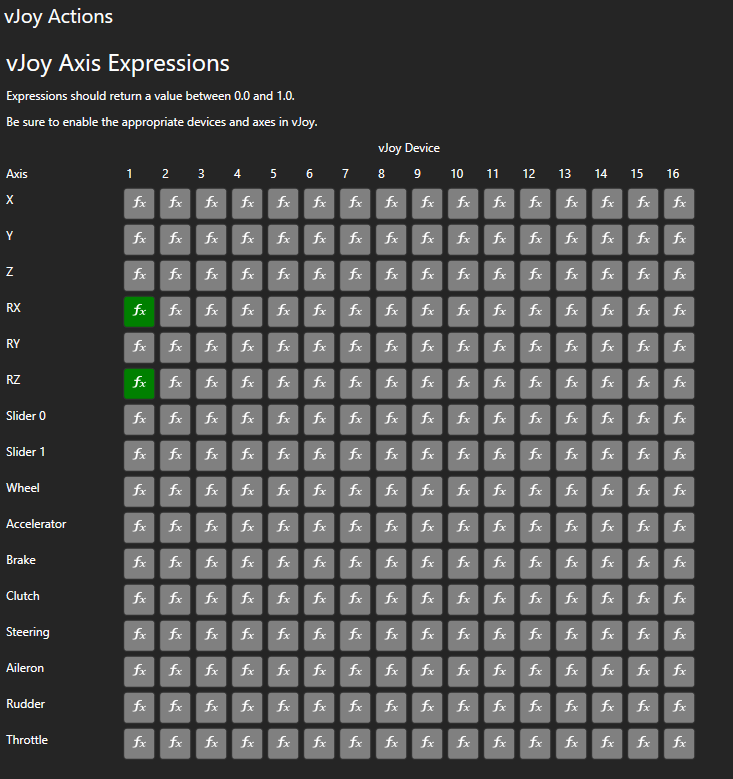

# vJoy Actions

This plugin provides SimHub events that can be used to trigger vJoy button presses. Among other things, this allows you to use a non-micro Arduino for buttons and inputs by mapping the events from the SerialDashPlugin to vJoy button outputs.

Additionally, vJoy axes can be controlled using NCalc/Javascript expressions.

## Installation

1) Download the latest release and copy `User.VJoyActions.dll` to your SimHub install directory.
2) For unknown reasons, SimHub will not auto-detect this plugin. Until I can fix this... 
    1) Open `SimHub/PluginsData/Common/ResolveCache.json` in the text editor of your choice
    2) Add an entry for this plugin to the `"UserPlugins"` array by appending this to the bottom of it.
    ```json
    {
        "Key": ".\\user.vjoyactions.dll",
        "Value": "User.VJoyActions.VJoyActionsPlugin"
    }
    ```

    3) Don't forget to add a comma after the previous plugin entry.

## Usage

On startup, the plugin will scan for enabled vJoy devices and create event targets for each available button. These can be used in the "Controls and Events" plugin to assign device inputs or other actions to vJoy buttons.



If you need to reconfigure vJoy to add more devices, or change the number of buttons on a device, just restart SimHub to pick up the changes.

To control vJoy axes, open the "vJoy Actions" settings page, either through the listing on the right, or "Additional Plugins", depending on how you enabled the plugin.



Here, you can write expressions to control the value of an axis for a device. These currently run at 30hz, but that may be configurable in the future. Be sure to enable the appropriate axis and device in vJoy.

The expressions must return a value between 0.0 and 1.0.